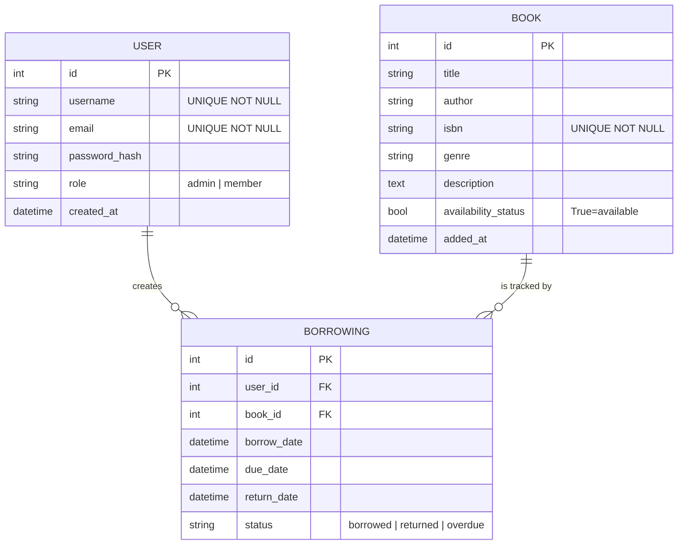
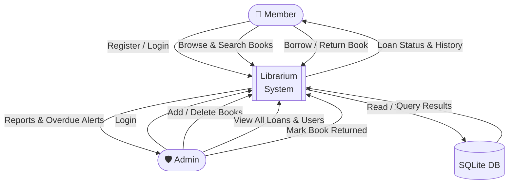
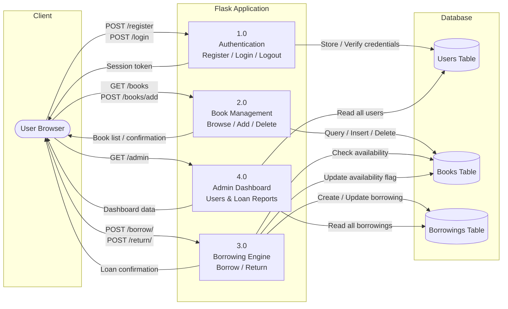
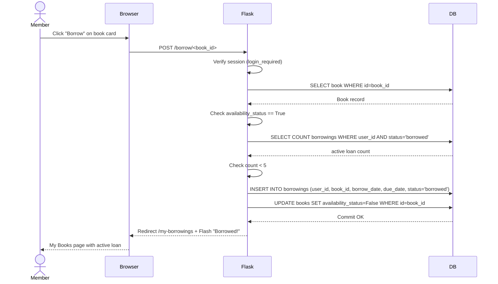

# System Design — Librarium

## Entity-Relationship Diagram (ERD)



---

## Data Flow Diagram (DFD) — Level 0 (Context Diagram)



---

## Data Flow Diagram (DFD) — Level 1 (Internal Processes)



---

## Sequence Diagram — Borrow a Book



---

## Folder Structure

```
librarium/
├── app.py                  # Application factory & entry point
├── config.py               # Config classes (Dev / Prod)
├── models.py               # SQLAlchemy models: User, Book, Borrowing
├── routes.py               # All Blueprint routes
├── requirements.txt
├── Dockerfile
├── docker-compose.yml
├── library.db              # Auto-generated SQLite database
├── templates/
│   ├── base.html           # Master layout (nav, flash messages, footer)
│   ├── index.html          # Dashboard / Home
│   ├── login.html          # Login form
│   ├── register.html       # Registration form
│   ├── books.html          # Book listing with search & filters
│   ├── add_book.html       # Add new book form (admin)
│   ├── my_borrowings.html  # User's active & past loans
│   └── admin.html          # Admin panel (users + all borrowings)
└── docs/
    └── system_design.md    # This file
```
